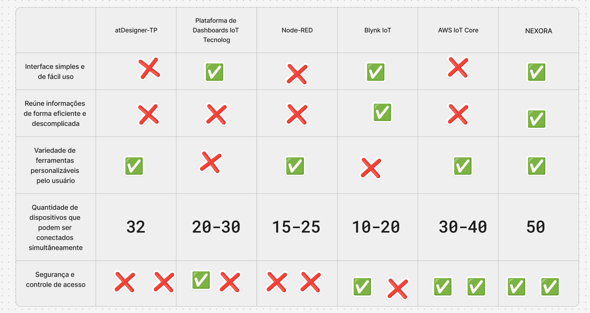

# Documentação de Interface: Plataforma Nexora

## 1. Visão Geral da Plataforma
A plataforma foi criada para armazenar e facilitar o gerenciamento de dados captados por sensores. A interface foi projetada para oferecer acompanhamento em tempo real, levantamento histórico e controle de parâmetros operacionais dos dispositivos.

---

### 1.1. Visão Geral do Problema
As Pequenas e Médias Empresas (PMEs) movimentam a economia real, mas a forma tradicional como o mercado vende "ESG" afasta o pequeno empresário.

| Indicador/Fator | O que os dados mostram? | O que isso significa na prática? |
| :---: | :---: | :---: |
| **Importância Econômica** | 26,5% do PIB e 80% das vagas de trabalho formais. | As PMEs sustentam o país, mas operam com margens de lucro apertadas. |
| **O Paradoxo do ESG** | 67% dos gestores não sabem o que a sigla ESG significa. | A maioria já faz boas ações no dia a dia, mas não sabe comprovar isso. |
| **Foco da Gestão** | O dono centraliza tudo e passa o dia "apagando incêndios". | Ninguém tem tempo para preencher relatórios longos e burocráticos. |
| **O Risco de Ficar Parado** | Grandes empresas e bancos já cobram critérios sustentáveis. | A empresa perde contratos de fornecimento e paga juros mais altos em empréstimos. |

---

## 2. Navegação Principal
A barra superior organiza o sistema em quatro abas principais:

* **Dispositivos:** Gestão individualizada, métricas e estado operacional de cada unidade conectada.
* **Dados:** Levantamento geral, relatórios consolidados e histórico analítico dos sensores.
* **Configuração:** Ajustes de parâmetros, preferências da plataforma e calibração dos aparelhos.
* **Alertas:** Painel centralizador de notificações críticas e avisos de manutenção urgente.

---

## 3. Painel do Dispositivo (Aba "Dispositivos")
Ao selecionar uma unidade específica, a tela apresenta **três seções principais**:

### 3.1. Gráficos de Desempenho
* **Formato:** Medidores radiais / mostradores analógicos (*gauges*).
* **Finalidade:** Monitorar grandezas instantâneas do equipamento em relação a escalas limites e faixas de tolerância.
* **Recursos Visuais:**
  * Indicadores de faixas seguras e limites operacionais.
  * Marcadores e avisos dinâmicos para limites ultrapassados.

### 3.2. Gráficos de Acompanhamento de Desempenho na Função
* **Formato:** Gráficos de linha contínuos (séries temporais).
* **Finalidade:** Avaliar a estabilidade, oscilações e tendências de comportamento do equipamento durante a execução de suas atividades.
* **Registro de Eventos:** Marcadores pontuais sobre a linha temporal destacando ocorrências e justificativas operacionais.

### 3.3. Dados Importantes
Painel de cartões com indicadores essenciais, pré-definidos conforme a função do aparelho e customizáveis pelo usuário:

* **Nível de Bateria / Carga:** Indicador percentual com avisos de recarga.
* **Temperatura / Nível Térmico:** Medidor com leitura de valor e estado de equilíbrio térmico.
* **Status Operacional:** Indicador de atividade e controle de funcionamento da unidade.

## 📌 Benchmarking

| Critério de Avaliação | atDesigner-TP | Dashboards IoT Tecnolog | Node-RED | Blynk IoT | AWS IoT Core | NEXORA |
| :--- | :---: | :---: | :---: | :---: | :---: | :---: |
| **Interface simples e de fácil uso** | ❌ | ✅ | ❌ | ✅ |❌| ✅ |
| **Reúne informações de forma eficiente** | ❌ | ❌ | ❌ | ✅ |❌| ✅ |
| **Variedade de ferramentas personalizáveis** | ✅ | ❌ | ✅ | ❌ |✅| ✅ |
| **Dispositivos simultâneos** | `32` | `20-30` | `15-25` | `10-20` |`30-40`| **`50`** |
| **Segurança e controle de acesso** | ❌ ❌ | ✅ ❌ | ❌ ❌ | ✅ ❌ |✅ ✅| ✅ ✅ |

 

 

> **Legenda:**
> * ✅ = Atendido / Suporte total
> * ✅ ❌ = Atendido parcialmente
> * ❌ = Não atendido
> * ❌ ❌ = Sem suporte / Crítico

  

